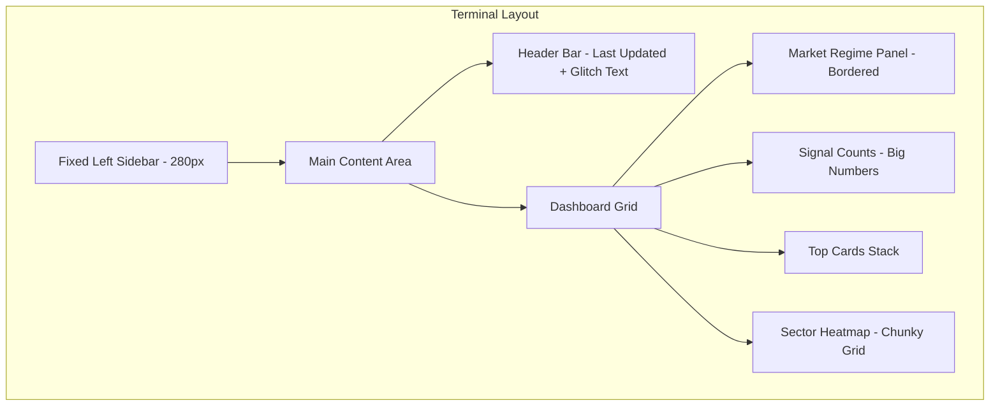
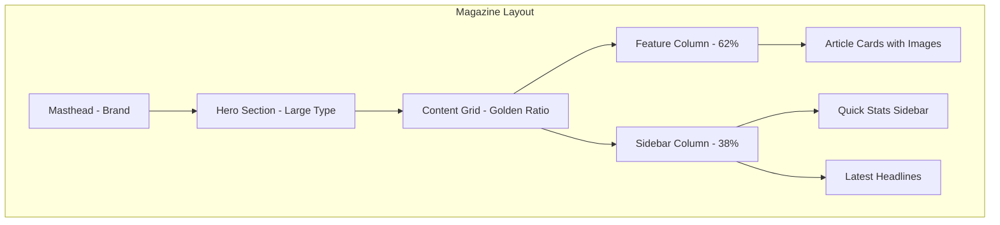
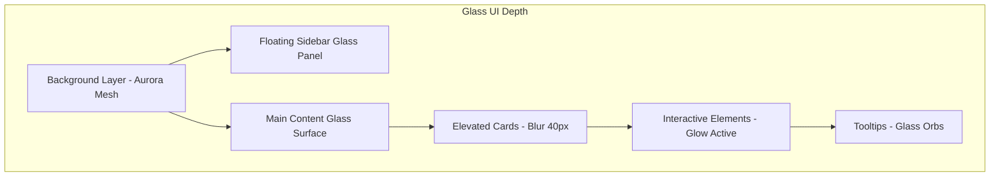
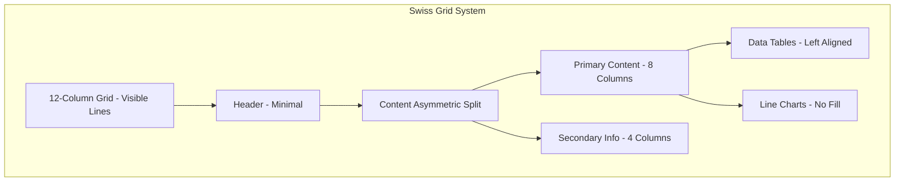
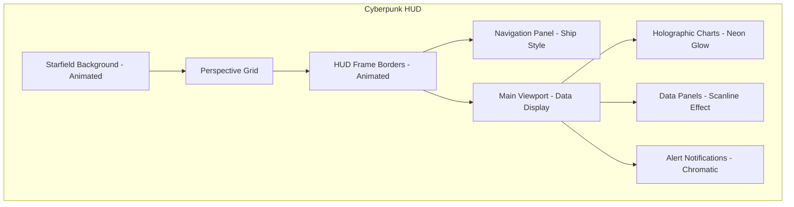
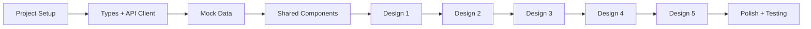

# StockXpert Frontend Architecture Plan

## Executive Summary

Build a premium fintech frontend for StockXpert - an AI-powered stock recommendation platform for Indian markets (NSE/Nifty 100). The frontend will feature **5 distinct design themes**, each with a unique aesthetic identity while sharing the same underlying data structure and API integration.

---

## Technical Stack

| Technology | Version | Purpose |
|------------|---------|---------|
| Next.js | 15 | React framework with App Router |
| Bun | latest | JavaScript runtime & package manager |
| Tailwind CSS | v4 | Utility-first CSS framework |
| TypeScript | 5.x | Type safety |
| Recharts | latest | Charting library for OHLCV visualization |
| Lucide React | latest | Icon library |

---

## Project Structure

```
frontend/
├── bun.lockb
├── bunfig.toml
├── package.json
├── next.config.ts
├── tailwind.config.ts
├── tsconfig.json
├── postcss.config.mjs
├── public/
│   ├── fonts/                    # Custom fonts per theme
│   └── images/
├── src/
│   ├── app/
│   │   ├── layout.tsx            # Root layout
│   │   ├── page.tsx              # Landing/redirect to /1
│   │   ├── globals.css           # Global styles
│   │   ├── 1/                    # Design 1: Neo-Brutalist Terminal
│   │   │   ├── layout.tsx
│   │   │   ├── page.tsx          # Dashboard
│   │   │   ├── recommendations/
│   │   │   │   └── page.tsx
│   │   │   ├── stocks/
│   │   │   │   └── [ticker]/
│   │   │   │       └── page.tsx
│   │   │   └── components/       # Theme-specific components
│   │   │       ├── navigation.tsx
│   │   │       ├── signal-card.tsx
│   │   │       ├── chart.tsx
│   │   │       └── ...
│   │   ├── 2/                    # Design 2: Editorial Luxury Magazine
│   │   │   └── ...
│   │   ├── 3/                    # Design 3: Biomorphic Glass Futurism
│   │   │   └── ...
│   │   ├── 4/                    # Design 4: Swiss International Minimalism
│   │   │   └── ...
│   │   └── 5/                    # Design 5: Cyberpunk Neon Noir
│   │       └── ...
│   ├── components/
│   │   └── shared/               # Shared base components
│   │       ├── base-chart.tsx
│   │       ├── base-card.tsx
│   │       └── ...
│   ├── lib/
│   │   ├── api/
│   │   │   ├── client.ts         # API client
│   │   │   ├── endpoints.ts      # Endpoint definitions
│   │   │   └── hooks.ts          # React Query hooks
│   │   ├── mock/
│   │   │   ├── dashboard.ts
│   │   │   ├── recommendations.ts
│   │   │   ├── stocks.ts
│   │   │   └── chart.ts
│   │   └── utils/
│   │       ├── format.ts         # Number/currency formatting
│   │       ├── colors.ts         # Color utilities
│   │       └── cn.ts             # Class name utility
│   └── types/
│       ├── api.ts                # Backend schema types
│       └── theme.ts              # Theme configuration types
```

---

## Backend API Integration

### Type Definitions (matching [`api.py`](backend/app/schemas/api.py))

```typescript
// types/api.ts

export interface RecommendationCard {
  ticker: string;
  company_name: string;
  source: string;
  direction: 'long' | 'short' | 'neutral';
  confidence_pct: number;
  certainty_pct?: number;
  current_price?: number;
  entry_price?: number;
  target_price?: number;
  stop_loss?: number;
  expected_return_pct?: number;
  risk_reward_ratio?: number;
  horizon: string;
  support?: number;
  resistance?: number;
  sector?: string;
  secondary?: Record<string, unknown>;
}

export interface ChartPoint {
  date: string;
  open: number;
  high: number;
  low: number;
  close: number;
  volume: number;
  overlays?: Record<string, number | null>;
  sma_20?: number;
  sma_50?: number;
  bb_upper?: number;
  bb_lower?: number;
  vwap_20?: number;
}

export interface DashboardResponse {
  generated_at: string;
  model_version: string;
  market_regime: {
    label: string;
    confidence: number;
    description?: string;
  };
  aggregate_sentiment: {
    score: number;
    label: string;
  };
  signal_counts: {
    long: number;
    short: number;
    neutral: number;
  };
  data_freshness: {
    last_price_date: string;
    last_sentiment_date: string;
  };
  sector_summary: Record<string, { long: number; short: number; neutral: number }>;
  top_cards: RecommendationCard[];
}

export interface RecommendationsResponse {
  generated_at: string;
  model_version: string;
  config_used: string;
  sources: string[];
  stocks_scanned: Record<string, number>;
  count: number;
  cards: RecommendationCard[];
}

export interface StockDeepDiveResponse {
  generated_at: string;
  ticker: string;
  company_name: string;
  model_version: string;
  current_price: number;
  predictions: Record<string, {
    direction: string;
    confidence_pct: number;
    expected_return_pct: number;
    entry_price: number;
    target_price: number;
    stop_loss: number;
  }>;
  gap_prediction: unknown;
  news_catalysts: Array<{
    date: string;
    headline: string;
    sentiment: number;
  }>;
  support_resistance: {
    support: number[];
    resistance: number[];
  };
  key_indicators: Record<string, number | null>;
  peer_comparison: Record<string, unknown>;
  features_snapshot: Record<string, unknown>;
  chart: ChartPoint[];
}

export interface StockChartResponse {
  generated_at: string;
  ticker: string;
  company_name: string;
  points: ChartPoint[];
}

export interface HealthResponse {
  status: string;
  generated_at: string;
  model_version?: string;
  artifacts: Record<string, unknown>;
  cache: Record<string, unknown>;
  supported_symbols?: number;
  last_runs: Record<string, string>;
}

export interface MetadataConfigResponse {
  generated_at: string;
  artifact_contract: {
    manifest_path: string;
    bundle_dir: string;
    checkpoint: string;
    scalers: string;
    calibrator?: string;
    run_config?: string;
    symbols_count: number;
    horizons: number[];
    windows: Record<string, number>;
    feature_counts: Record<string, number>;
    model_version: string;
    supported_symbols?: string[];
    ready?: boolean;
  };
}
```

### API Endpoints

| Endpoint | Method | Purpose |
|----------|--------|---------|
| `/api/health` | GET | Service status |
| `/api/metadata/config` | GET | Horizons, trained symbols |
| `/api/dashboard` | GET | Market overview, top cards |
| `/api/recommendations` | GET | Ranked recommendation cards |
| `/api/stocks/{ticker}` | GET | Stock deep dive |
| `/api/stocks/{ticker}/chart` | GET | OHLCV + overlays |

---

## Design Themes Overview

### Route Structure

| Route | Theme Name | Aesthetic |
|-------|------------|-----------|
| `/1` | Neo-Brutalist Terminal | Bloomberg meets industrial raw |
| `/2` | Editorial Luxury Magazine | Monocle/Economist refined |
| `/3` | Biomorphic Glass Futurism | Apple Vision Pro organic |
| `/4` | Swiss International Minimalism | Helvetica objective precision |
| `/5` | Cyberpunk Neon Noir | Blade Runner holographic |

---

## Design 1: Neo-Brutalist Financial Terminal

### Visual Specifications

```css
:root {
  --bg-primary: #0a0a0a;
  --bg-secondary: #141414;
  --text-primary: #ffffff;
  --text-secondary: #888888;
  --accent-bullish: #00ff41;
  --accent-bearish: #ff0040;
  --accent-warning: #ff6b35;
  --border-color: #ffffff;
  --border-width: 3px;
}
```

**Typography:**
- Display: Space Mono / DM Mono
- Numbers: JetBrains Mono
- All monospace for terminal feel

**Layout:**
- Asymmetric grid with overlapping sections
- Left sidebar with chunky navigation
- Sharp 90° corners everywhere
- Hard offset shadows (no blur)
- Scanline noise texture overlay

### Mermaid: Layout Flow



### Key Components

1. **GlitchText**: Numbers that flicker/scramble on update
2. **TerminalCard**: Thick bordered cards with offset shadows
3. **BrutalChart**: Thick candlestick bodies, no rounded caps
4. **ScanlineOverlay**: CSS-based scanline effect
5. **TypewriterTitle**: Text that types out character by character

---

## Design 2: Editorial Luxury Magazine

### Visual Specifications

```css
:root {
  --bg-primary: #faf9f6;
  --bg-secondary: #f5f4f1;
  --text-primary: #1a1a1a;
  --text-secondary: #666666;
  --accent-primary: #722f37; /* Deep burgundy */
  --accent-secondary: #d4af37; /* Burnished gold */
  --accent-bullish: #004225; /* British racing green */
  --accent-bearish: #722f37;
}
```

**Typography:**
- Display: Playfair Display (serif, high contrast)
- Body: Source Serif Pro
- Numbers: FF Tisa Sans / Tabular

**Layout:**
- Golden ratio proportions
- Massive hero typography
- Generous margins (60-80px)
- Section breaks with decorative rules
- Pull quotes as design elements

### Mermaid: Editorial Grid



### Key Components

1. **MastheadNav**: Editorial top navigation
2. **PullQuote**: Decorative highlighted quotes
3. **ArticleCard**: Magazine-style cards with duotone images
4. **SparklineChart**: Elegant hairline stroke charts
5. **SectionDivider**: Decorative rules with ornaments

---

## Design 3: Biomorphic Glass Futurism

### Visual Specifications

```css
:root {
  --bg-void: #050508;
  --glass-bg: rgba(255, 255, 255, 0.05);
  --glass-border: rgba(255, 255, 255, 0.1);
  --accent-cyan: #00d4ff;
  --accent-lavender: #e8d5f7;
  --accent-coral: #ff6b6b;
  --blur-amount: 40px;
  --glow-spread: 20px;
}
```

**Typography:**
- Display: Satoshi / Cabinet Grotesk
- Body: Plus Jakarta Sans
- Rounded, friendly, approachable

**Layout:**
- Floating card system with varying elevations
- Rounded corners everywhere (16-24px)
- Aurora gradient mesh background
- Glassmorphism with backdrop-blur
- Organic flowing boundaries

### Mermaid: Glass Layers



### Key Components

1. **GlassCard**: Frosted glass with backdrop-blur
2. **AuroraBackground**: Animated gradient mesh
3. **BreathingElement**: Subtle scale pulsing animation
4. **GlowChart**: Gradient area charts with glow
5. **FloatingNav**: Detached-feeling sidebar

---

## Design 4: Swiss International Minimalism

### Visual Specifications

```css
:root {
  --bg-primary: #ffffff;
  --bg-secondary: #f5f5f0;
  --text-primary: #000000;
  --text-secondary: #666666;
  --accent-red: #da291c;
  --accent-cyan: #00a9e0;
  --grid-line: #e0e0e0;
}
```

**Typography:**
- Display: Neue Haas Grotesk / Helvetica Now
- Body: Suisse Int'l / Atlas Grotesk
- Numbers: GT America Mono

**Layout:**
- Strict 12-column grid
- Asymmetric balance
- Flush left, ragged right
- Maximum 2 font sizes per component
- Visible grid lines (subtle)

### Mermaid: Swiss Grid



### Key Components

1. **GridOverlay**: Subtle visible 12-column grid
2. **ObjectiveCard**: No decorative elements
3. **DataTable**: Clean, aligned data presentation
4. **LineOnlyChart**: Pure lines, no fills
5. **TypeScaleSystem**: Strict size hierarchy

---

## Design 5: Cyberpunk Neon Noir

### Visual Specifications

```css
:root {
  --bg-deep: #0d0221;
  --bg-surface: #1a0b2e;
  --accent-pink: #ff00ff;
  --accent-cyan: #00ffff;
  --accent-yellow: #ffff00;
  --glow-pink: 0 0 20px #ff00ff;
  --glow-cyan: 0 0 20px #00ffff;
}
```

**Typography:**
- Display: Orbitron / Eurostile Extended
- Body: Rajdhani / Exo 2
- Numbers: Chakra Petch (LED aesthetic)

**Layout:**
- HUD cockpit aesthetic
- Diagonal layout lines
- Animated border traces
- Perspective grid background
- Floating parallax depth

### Mermaid: HUD Layout



### Key Components

1. **HUDFrame**: Animated border traces
2. **NeonText**: Chromatic aberration effect
3. **HolographicChart**: 3D projection feel
4. **DigitalRainTransition**: Matrix-style data updates
5. **CrosshairCursor**: Custom tracking cursor

---

## Shared Components Architecture

### Base Chart Component

The charting component will be a shared base that accepts theme-specific styling props:

```typescript
interface ThemeChartProps {
  data: ChartPoint[];
  overlays: {
    sma20: boolean;
    sma50: boolean;
    bollingerBands: boolean;
    vwap: boolean;
  };
  theme: {
    candleUp: string;
    candleDown: string;
    gridColor: string;
    textColor: string;
    volumeColor: string;
    borderRadius: number;
    strokeWidth: number;
    showGlow: boolean;
    glowColor?: string;
  };
}
```

### Shared Utilities

1. **Currency Formatter**: INR formatting with lakhs/crores
2. **Percentage Formatter**: Color-coded positive/negative
3. **Date Formatter**: IST timezone handling
4. **cn utility**: Tailwind class merger (clsx + tailwind-merge)

---

## Mock Data Strategy

To enable development without backend dependency:

```typescript
// lib/mock/recommendations.ts
export const mockRecommendations: RecommendationCard[] = [
  {
    ticker: 'RELIANCE.NS',
    company_name: 'Reliance Industries Ltd',
    source: 'ml_model',
    direction: 'long',
    confidence_pct: 87.5,
    current_price: 2456.80,
    entry_price: 2445.00,
    target_price: 2620.00,
    stop_loss: 2380.00,
    expected_return_pct: 7.15,
    risk_reward_ratio: 2.69,
    horizon: '5d',
    support: 2380.00,
    resistance: 2620.00,
    sector: 'Energy'
  },
  // ... more mock data for all 86 symbols
];
```

---

## Color Coding System

Each theme adapts the signaling colors while maintaining semantic meaning:

| Signal | Design 1 | Design 2 | Design 3 | Design 4 | Design 5 |
|--------|----------|----------|----------|----------|----------|
| Bullish/Long | #00ff41 (neon green) | #004225 (racing green) | #00d4ff (cyan) | #00a9e0 (process cyan) | #00ffff (electric cyan) |
| Bearish/Short | #ff0040 (electric red) | #722f37 (burgundy) | #ff6b6b (coral) | #000000 (black) | #ff00ff (hot pink) |
| Neutral | #888888 (gray) | #666666 (gray) | #e8d5f7 (lavender) | #666666 (gray) | #ffff00 (yellow) |
| High Confidence | Glitch animation | Gold accent | Extra glow | Bold weight | Chromatic aberration |
| Low Confidence | Dimmed/faded | Smaller text | Reduced opacity | Gray text | No glow |

---

## Performance Considerations

1. **Font Loading**: Use `next/font` with display swap
2. **Image Optimization**: Use `next/image` for any graphics
3. **Code Splitting**: Each theme route is separate bundle
4. **Animations**: Prefer CSS animations, use `framer-motion` sparingly
5. **Chart Performance**: Limit data points, use virtualization if needed

---

## Implementation Order



### Phase 1: Foundation
- Initialize Next.js + Bun project
- Configure Tailwind v4
- Set up TypeScript types
- Build API client
- Create mock data utilities

### Phase 2: Shared Infrastructure  
- Base chart component with Recharts
- Utility functions
- Base layout structures

### Phase 3: Theme Implementation (5 parallel tracks)
- Each design implemented as isolated route
- Theme-specific components
- Full dashboard, recommendations, stock detail views

### Phase 4: Polish
- Loading states per theme aesthetic
- Error states per theme aesthetic
- Responsive behavior
- Accessibility audit
- Performance optimization

---

## Font Loading Strategy

```typescript
// Per-theme font configuration
const design1Fonts = {
  display: localFont({ src: './fonts/SpaceMono-Bold.woff2' }),
  mono: localFont({ src: './fonts/JetBrainsMono-Regular.woff2' }),
};

const design2Fonts = {
  display: Playfair_Display({ subsets: ['latin'] }),
  body: Source_Serif_4({ subsets: ['latin'] }),
};

// etc.
```

---

## Questions for Clarification

1. **Backend URL**: Should the frontend hardcode `http://localhost:8000` or use environment variables for API base URL?

2. **Authentication**: Is there any auth required, or is this purely a public dashboard?

3. **Real-time Updates**: Should the dashboard poll for updates, or is manual refresh acceptable?

4. **Mobile Priority**: Are all 5 designs equally important on mobile, or is desktop the primary target?

5. **Chart Library Preference**: The spec mentions Recharts - is that firm, or would Lightweight Charts (TradingView) be acceptable for better candlestick rendering?

---

## Next Steps

Upon approval of this plan:

1. Switch to **Code mode** to initialize the project
2. Implement foundation (types, API client, mock data)
3. Build shared components
4. Implement each design theme sequentially
5. Final polish and testing

---

*Plan created: 2026-03-26*
*Target: StockXpert Premium Fintech Frontend*
*Themes: 5 distinct design systems*
